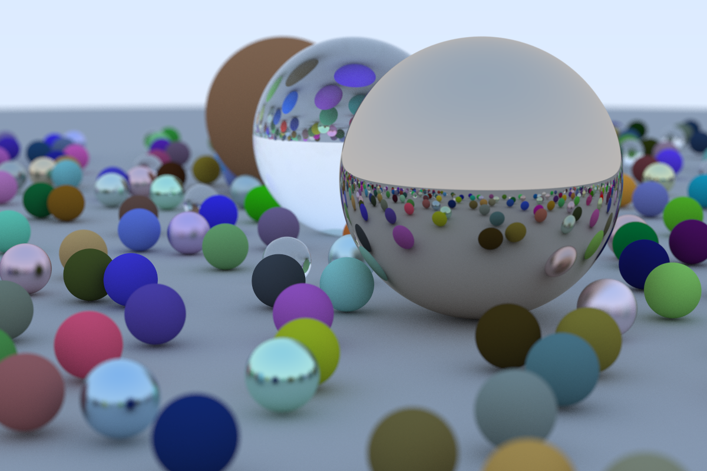

---
# Raytracing in One Weekend
A super simple raytracing renderer for spheres implementing three material types: diffuse (Lambertian), metal, and dielectric (glass).

Created from the course contents of the [*Raytracing in One Weekend*](https://raytracing.github.io/) book by Peter Shirley. Many thanks for properly inspiring myself and many others' future graphics programming endeavors.